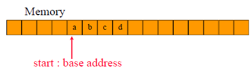
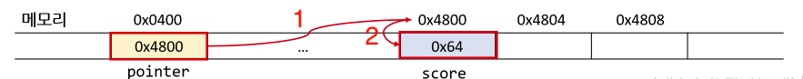

# 자료구조 스터디 2차시(배열과 구조들)


## Data structure

* Data structure ≡ data type + storage structure
* Data type
  * How to categorize data objects
  * Object + operator
* Abstract Data Type (ADT)
  * Specification of objects and operations independent of their implementation

***Performance of a program largely depends on data structures !!***


## Abstarct Data Type(ADT) of Array

> ADT array is
>
> objects:
>
> ​	A set of pairs <index, value> where for each value of index there is a value from the set item. Index is a finite ordered set of one or more dimensions, for example, {0, · · · , n-1} for one dimension, {(0, 0), (0, 1), (0, 2), (1, 0), (1, 1), (1, 2), (2, 0), (2, 1 ), (2, 2)} for two dimensions, etc.
>
> functions:
>
> ​	for all A ∈ Array, i ∈ index, x ∈ item, j, size ∈ integer
>
> ​	Array Create(j, list) ::= **return** an array of j dimensions where list is a j-tuple whose ith element is the the size of the ith dimension. *Items* are undefined. 
> ​	Item Retrieve(A, i) ::= **if** (i E index) **return** the item associated with index value i in array A **else** **return** error
>
> ​	Array Store(A,i,x) ::= **if** (i in index) **return** an array that is identical to array A except the new pair <i, x> has been inserted **else return** error.

* A set of pairs <index, value>
* ADT for array provides operations that
  * retrieves a value
  * stores a value

## Array in C

### 1D array



* map into configuous memory locations

* location(array[i]) = start + i

``` c
int main(void){
    int i,*list,list2[5] = {0,1,2,3,4}; list1 = list2; //declaration
    printf(list2 == &list2[0] ? "true\n" : "false");
    scanf("%d",&i);
    printf(list2 + i == &list1[i]  ? "true\n" : "false");
    scanf("%d",&i);
    printf(*(list1+i) == list2[i] ? "true\n" : "false");
}
```

* |                    | **list1**                                                    | **list2**                                                    |
  | ------------------ | ------------------------------------------------------------ | ------------------------------------------------------------ |
  | **정의**           | pointer                                                      | array name                                                   |
  | **공통점**         | 둘 다 정수를 가리키는 포인터                                 | 둘 다 정수를 가리키는 포인터                                 |
  | **주소 값의 변경** |                                                              | 불가능(++ 불가능)(5개 정수를 위한 메모리 위치가 예약되어 있다. |
  | **기타**           | (int *list1 = list2) 포인터 변수가 배열을 참조하면 포인터 변수를 배열처럼 사용할 수 있다. |                                                              |

```c
#include <stdio.h>

void print1(int*, int);

void main(){  
	int one[] = { 0, 1, 2, 3, 4};
	int size = _____________________;
	print1Darry(____,____);
}

void print1Darry(int *ptr, int row){
	/* print out a one-dimensional array using a pointer */
	int i;
	printf("Address Contents\n");
    for (i=0; i<row; i++)
    printf("%8u%5d\n", ptr+i, *(ptr+i) );
    printf("\n");
}
```

<details>
	<summary>정답보기/가리기</summary>
```c
void main(){	
	int one[] = { 0, 1, 2, 3, 4};
	int size = sizeof(one)/sizeof(int);
	print1Darry(one,size);
}
```
</details>

* 참조와 역참조

  * 참조: 포인터가 주소를 가리키는 것 ex) ```int i=3,*a =&i;``` a는 i의 주소를 참조하고 있다

  * 역참조: 주소에 있는 값에 접근 하는 것 ex) ```printf("%d",*a);``` ``` *a = 3;``` a가 가리키는 주소의 값을 역참조하고 있다.

  * list[i]가 '=' 우측 : (list+i)가 가리키는 값 반환 

    list[i]가 '=' 좌측 : 값을 (list+i) 위치에 저장

    *  (예) list[1]=list[2] : 둘다 역참조 중이다.

* A\[u1]\[u2]\[u3]\[u4]; A\[0]\[0]\[0]\[0] → position a
  * A\[0]\[0]\[0]\[1] → position a + 1
  * A\[0]\[0]\[0]\[u4-1] → position a + u4 -1
  * A\[0]\[0]\[1]\[0] → position a + u4
  * A\[i]\[j]\[k]\[l] → position: a + $i*u_2 u_3 u_4 + j*u_3 u_4 + k * u_4 + m$

* 연습문제

  ```
  int arr[3][4][5][6];
  arr[2][3][1][0] == &a[0][0][0][0]+___?
  ```


