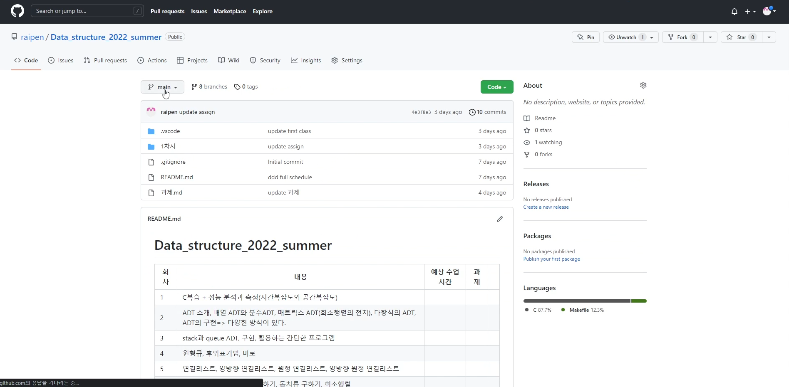
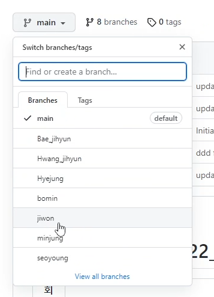
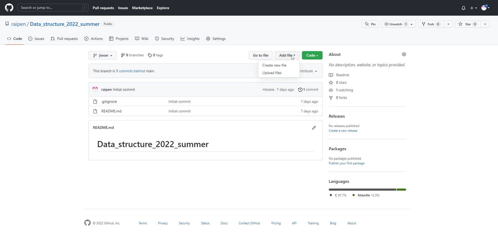
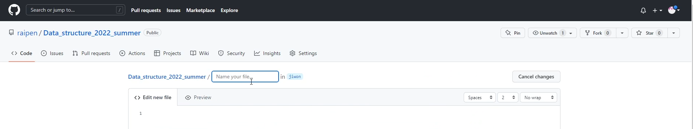
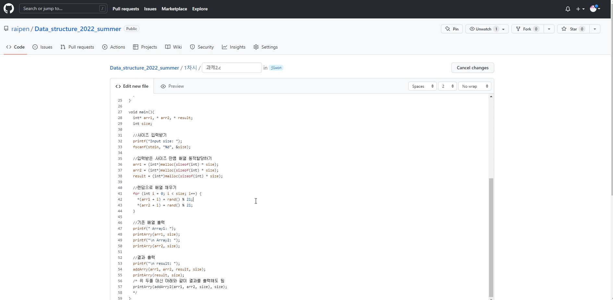
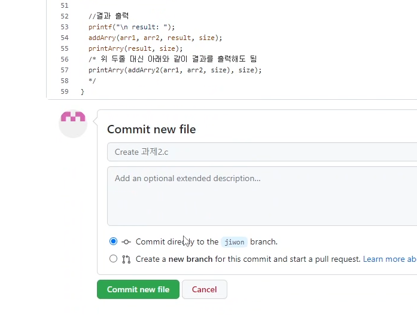
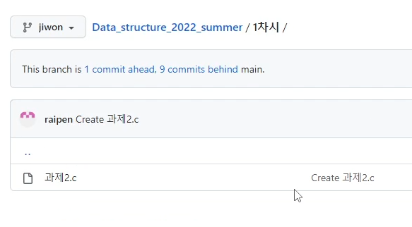
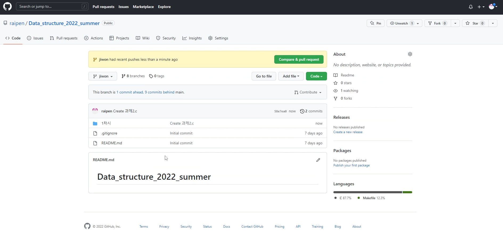

1. https://github.com/raipen/Data_structure_2022_summer 접속

   

2. 자기 이름 브랜치 선택	

3. Add file->Create new file 클릭
4. 상단에 n차시/파일명.c 입력, 밑에 코드 입력 
5. 밑으로 쭉 내려서 Commit new file 클릭 
6. 그러면 이런식으로 저장됨. 끝

* Data_stucture_2022_summer/n차시/ 폴더에 해당 파일이 저장됨. Data_stucture_2022_summer를 클릭하면 전체 폴더가 이런 식으로 나옴

* 각 파일 클릭하고 연필 누르면 편집, 쓰레기통 누르면 삭제 

  